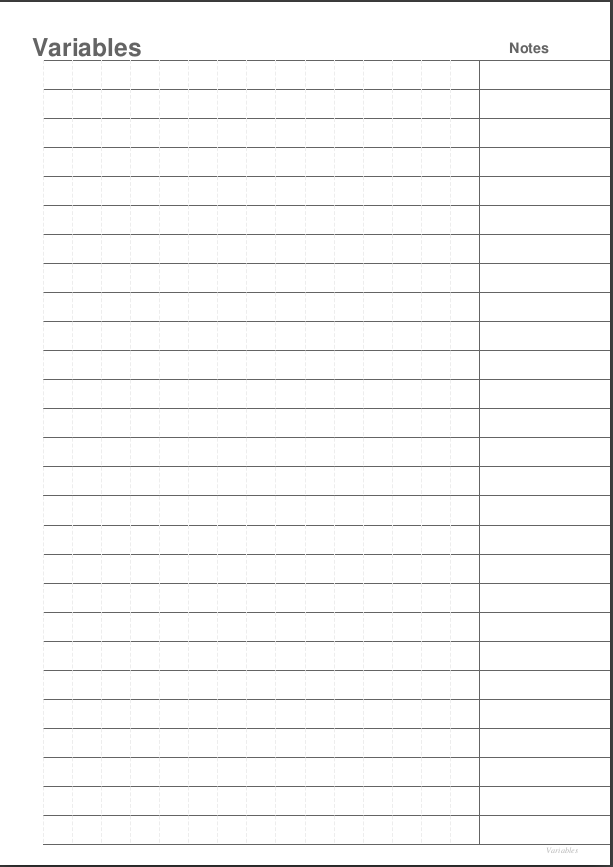

# Création d'un notebook a partir d'un fichier CSV
J'ai créer un cahier de note pour mon apprentissage de python.
La première partie quadrillée pour marquer du code et pouvoir indenter celui-ci grâce aux lignes verticales.
La deuxième partier a droite pour écrire des notes à la main.

## Objectifs

1. Créer un PDF à partir d'un fichier CSV.
2. Créer un header et un footer sur chacune des pages.
3. Créer un PDF multi pages.
4. Approfondir l'utilisation de la libraire fpdf.

### Design

